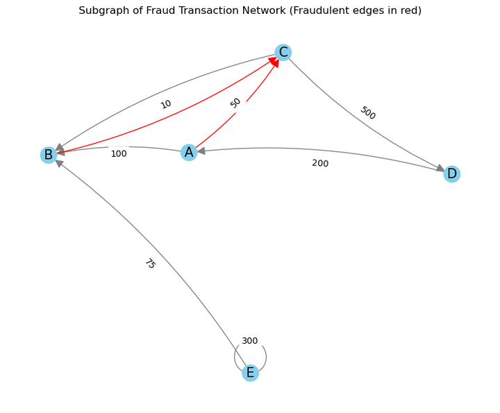
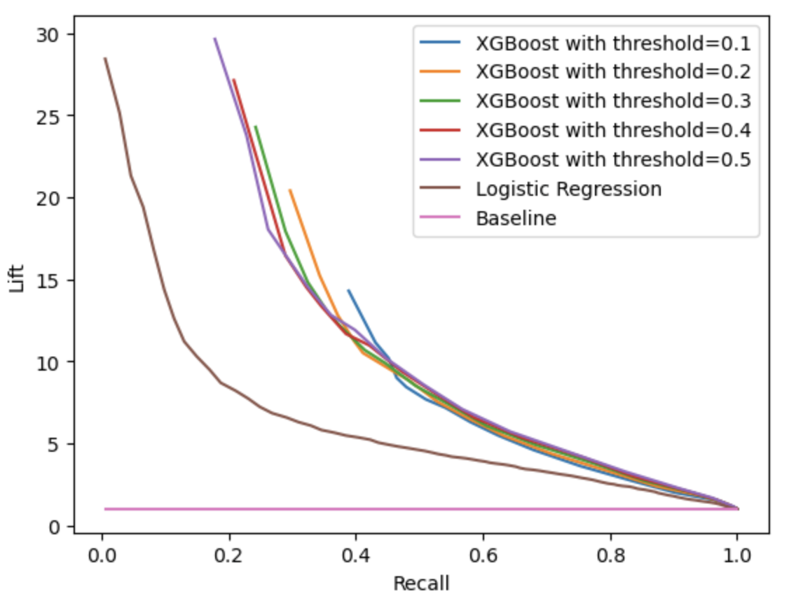

#  **Fast Fraud Screening:** _Using Lightweight Models to Flag Risk Before Deep Analysis_ 

Team members: [Abdullah Ahmed](https://github.com/abdullah5523p), [Noimot Bakare Ayoub](https://github.com/unomics20), [Cyril Morluyan Cordor](https://github.com/cyril-cordor), [Brandon Owens](https://github.com/Brandon-Owens)

This project is in fulfillment of the [Erdös Institute](https://www.erdosinstitute.org/) Data Science Program for Fall 2025.

**Deliverables**
- 5-minute video presentation
- Presentation slides PDF
- Executive Summary

**Disclosure:** Documents, notebooks, code, visualizations etc. displayed in this repository include or reference data provided by J.P. Morgan Chase & Co.

# Contents

1. [Introduction](#Introduction)
2. [Dataset](#Dataset)
3. [Methods, Models, Engineered Features
](#Methods%20and%20Models)
4. [Key Performance Indicators](#Key%20Performance%20Indicators)
5. [Results](#Results)
6. [Challenges and Future Work](#Challenges%20and%20Future%20Work)
7. [Files](#Files)

## Introduction
Financial fraud is a growing challenge. This project proposes a two-stage fraud detection framework: a lightweight "surrogate model" screens transactions, prioritizing high recall, then flagged transactions go to intensive models/human analysts for verification. This reduces computational load, speeds detection, and focuses resources. Using J.P. Morgan Chase & Co's synthetic data, our XGBoost model achieved 7x Lift and 70% recall, flagging 1 in 4 fraud cases while incorrectly flagging less than 1% of legitimate transactions. We propose a "Lift" metric (recall and predicted positive rates) for efficiency, finding traditional metrics misleading.

## Dataset

We utilize the [J.P. Morgan Chase & Co. Payment Data for Fraud Protection](https://www.jpmorganchase.com/about/technology/research/ai/synthetic-data), a synthetic dataset generated due to privacy concerns. This subject-centric data contains over 1.49 million transactions (electronic transfers, bill payments, deposits, withdrawals) spanning approximately 50 years. Each entry details the transaction amount in U.S. dollars, involved accounts (sender, beneficiary, or both), and other identifying features.

    
 <b> Image source: J.P. Morgan Chase & Co. </b> 

Unfortunately, we cannot give full access to the Fraud Payment Data due to the Terms of Use agreement with J.P. Morgan Chase & Co.

## Methods and Models

### Methods

We engineer both transaction and graph-derived features to train a lightweight, high-recall fraud screening model.

To analyze the complex network of over 300,000 customer and merchant accounts, we used Python’s NetworkX package to construct a multi-directed graph. A multi-directed graph is a network structure composed of nodes, representing sender or beneficiary accounts, and the edges represent transactions. Edge direction shows fund flow – who is sending versus who is receiving the funds – and multiple edges indicate repeated transfers. Fraud often occurs in clusters of accounts cycling funds among themselves, making the graph view effective for uncovering hidden connections and identifying potential fraud rings.

	
	

### Models

Logistic Regression, XGBoost, Linear Discrimination Analysis, PCA

## Key Performance Indicators

### Model Performance KPI

Our Key Performance Indicators include the percentage of fraud transactions correctly flagged (Recall),  and a measure of how much better the model is at identifying fraud compared to random guessing (Lift). We examined the trade-offs between recall and lift for our XGBoost model across different thresholds. The optimal threshold is 0.5, where the model achieves 70% recall, balancing detection coverage and precision.

### Business KPI

We use synthetic data to create realistic fraud risk KPIs, evaluating the model on false positives, analyst workload savings, simulated loss-avoidance scores, total loss avoided (USD), and total review cost. Key takeaways:

- Our lightweight model offers high speed and low computational overhead, suitable for real-time deployment.
- Initially, the model showed a low false positive rate (~1%).
- However, it currently has a high fraud miss rate (~66%), requiring threshold tuning for recall-first performance.
- With adjustments, we anticipate achieving high recall, aligning with bank fraud pre-screening strategies.

Table 1: Business KPIs

| Metric | Result | Interpretation |
|:-----------:|:-----------:|:-----------:|
| Fraud Detection Recall | 24% | % of fraud successfully flagged |
| False Negative Rate | 76% | % of fraud missed |
| False Positive Rate | >1% | % of legitimate transactions flagged |
| Synthetic Loss Avoided | $2,357,370 | Proxy dollars saved by catching fraud |
| Total Review Cost | $20,960 | Cost of analyst reviewing alerts |
| Missed Fraud Risk | $1,916,768 | Proxy dollars lost from missed fraud |

*Note: Synthetic values approximate business value since the data set is synthetic. A back of envelope calculation assumes an analyst makes $50 (salary+benefits) it costs approximately $10 at 4 minutes per alert.* 

## Results

Initial results show strong computational performance and low false positive rate, demonstrating feasibility for real time screening. At the current decision threshold (0.5) fraud detection remains limited, resulting in a high miss rate. Future iterations will adjust model tuning, and thresholding to increase recall, the primary objective of the model, while maintaining manageable volume alert. This stage validates the model architecture and provides a foundation for a high-recall optimization in subsequent experiments.

| | Precision | Recall | F1-Score |
|:-----------:|:-----------:|:-----------:|:-----------:|
| 0 (Non-Fraud) | 0.98 | 0.97 | 0.98 |
| 1 (Fraud) | 0.13 | 0.26 | 0.17 |

 *Table 2:* Training Accuracy for Logistic Regression (with cutoff 0.1) is 0.956 

Table 3: Training accuracy for XGBoost is 0.979 

| | Precision | Recall | F1-Score |
|:-----------:|:-----------:|:-----------:|:-----------:|
| 0 (Non-Fraud) | 0.99 | 0.98 | 0.98 |
| 1 (Fraud) | 0.24 | 0.29 | 0.26 |

These results don't reflect our model's preprocessing effectiveness. We suggest using 'Lift,' a standard data science metric, instead,

$$\text{\large Lift} = \dfrac{ \dfrac{\text{TP}}{\text{TP} + \text{FN}}}{\dfrac{\text{FP} + \text{TP}}{\text{FP} + \text{TP} + \text{TN} + \text{FN}}}$$

This metric, similar to recall but with Predicted Positive Rate (PPR) in the denominator, measures efficiency. It prioritizes high fraud detection (recall) and a low PPR, aiming to minimize missed fraud and human agent workload by forwarding essential cases.

Any randomized model has Lift = 1, and Figure 4  shows how our models have the flexibility to trade Recall for Lift:
For instance, with recall reduced to 70%, our XGBoost model boasts 7x the Lift of the baseline. This significantly boosts fraud detection efficiency and dramatically cuts operational costs.

**Figure 4**

## Challenges

Developing a fraud detection model using the J.P. Morgan dataset presents three main challenges:

1. **Feature Engineering:** New features must be generated from raw transaction data to uncover fraudulent patterns.

2. **Imbalanced Data:** Fraudulent transactions (2.06% of 1.49 million+) are significantly outnumbered by non-fraudulent ones, making it difficult for a model to learn (Figures ??).

3. **Synthetic Data Artifact:** Transaction timestamps in this synthetic dataset may follow a pattern, potentially lacking predictive information about fraud, as fraudulent labels were assigned using predefined probabilities.

4. **Normal metrics like accuracy and PR-AUC do not reflect the performance** of our filter well. Instead we use 'Lift,' a standard data science metric that measures efficiency and is defined as follows:

## Files

### Notebooks

- `Visual-whatever.ipynb`: visual stuff
- `Model.ipynb`: modelling
- 

